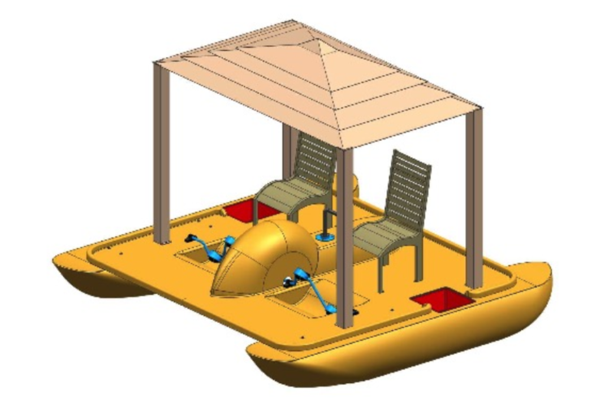
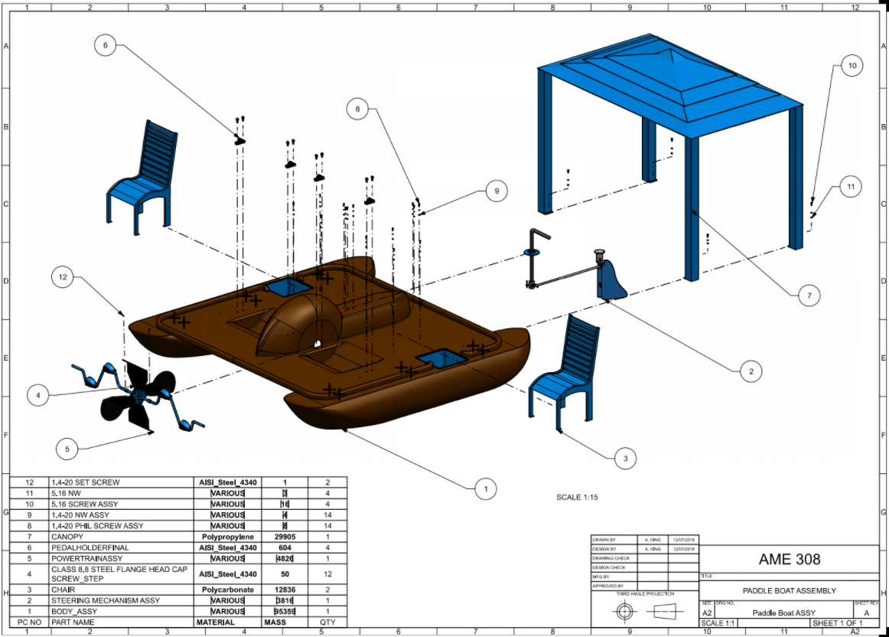

# Backyard Paddle Boat

## Authors/Designers
* OpeOluwa (Ayo) Otegbade
* Timothy Bean
* Alexander King
* Julius Page

## Description
The paddleboat was designed for leisure. It comes equipped with cutouts for coolers or supplies in the pontoons at arm’s length for a warm summer day. If the day is particularly bright, the gazebo design of the canopy provides much more shade than a fabric sun cover. The chairs were designed to mimic the look of a backyard lawn chair, so the user can feel at home when you are in the middle of the water. The paddleboat was not made for speed, but rather for a relaxing day out on the lake. Extra deck space offers cargo room and the ease of taking a quick jump into the water. The rubberized pedals were designed so that it can be equally as comfortable and grip-able with or without shoes on.

Practically, the paddleboat is collapsible. Different than most paddleboats, the pontoons can be removed from the deck, as well as the chairs and the canopy. This allows for easier transportation and movement. The paddleboat can be assembled and disassembled by one person.

## Design and Requirements
The paddleboat was designed such that all parts are assemble-able and can be inserted into their fittings. Certain parts are pre-manufactured such as the bearing attached to the tiller arm. From a cost standpoint, it is cheaper to do so rather than generating a complex geometry in a simple and cheap geometry (such as a tube) to allow for assembly. The finished fully assembled model of the paddleboat can be found the images below

